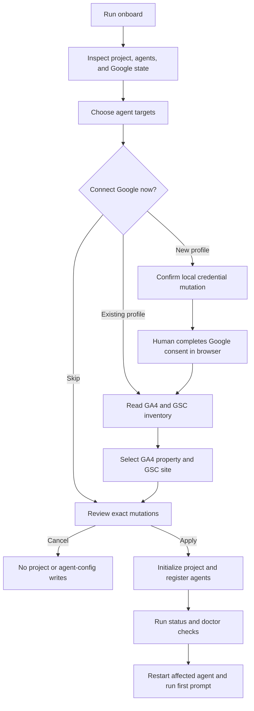

# AItraffic Onboarding Roadmap

> [!IMPORTANT]
> This document preserves the original onboarding milestones. Its historical
> version labels no longer match the current `0.7.0` package line. See the
> authoritative [Project status](../STATUS.md) for the active priority order.

## Product goal

Make the first useful AItraffic session take less than two minutes:

```bash
npx -y aitraffic@latest onboard
```

The command should feel native in a terminal, work well beside Codex and
Claude Code, and preserve a direct non-interactive contract for agents and CI.
The setup experience must never print or place Google credentials in the
project, an agent prompt, MCP output, or Git.

## Experience principles

1. Detect before asking.
2. Select only the agents and data sources the user wants.
3. Make `Skip for now` a first-class path.
4. Show the exact mutations before applying them.
5. Re-running setup verifies and repairs instead of creating duplicates.
6. Keep Google consent in the browser and credential use outside MCP.
7. End with a verified status and a ready-to-copy first prompt.
8. Keep a machine-readable path for Codex, Claude Code, scripts, and CI.

## Canonical flows

### Guided human setup

```text
$ npx -y aitraffic@latest onboard

AItraffic onboarding

◆ Where should AItraffic be available?
  ◼ Codex        already configured
  ◼ Claude Code  detected
  ◻ Hermes       detected
  ◻ OpenClaw     detected

◆ Google data
  ● Use local profile "work"
  ○ Connect another Google account
  ○ Import a different OAuth client (advanced)
  ○ Skip for now

◆ GA4 property
  ● Example Site — 123456789

◆ Search Console site
  ● sc-domain:example.com

┌ Review
│ Keep existing AItraffic project
│ Keep existing Codex registration
│ Add AItraffic to Claude Code
│ Select Google profile "work"
│ Select GA4 123456789
│ Select GSC sc-domain:example.com
└

◆ Apply this setup? Yes

AItraffic is ready.
Start a new agent task and ask:
"Use AItraffic to analyze AI acquisition for the last 28 days."
```

### Advanced local Google setup

Until hosted OAuth is live, a new public user can import a Google Web OAuth
client JSON. AItraffic stores the client secret and tokens in the operating
system credential store. The project receives only a profile label and
explicit GA4/GSC identifiers.

```text
Import client JSON → browser consent → inventory → explicit selection
```

### Agent and CI setup

Interactive prompting is never attempted without a TTY. Agents can inspect the
environment safely:

```bash
aitraffic onboard --check --format json
aitraffic onboard --non-interactive --format json
```

They can then use the existing direct commands:

```bash
codex mcp add aitraffic -- npx -y aitraffic@latest mcp serve
claude mcp add --scope project aitraffic -- npx -y aitraffic@latest mcp serve
aitraffic google select --profile work --ga4-property 123 --gsc-site sc-domain:example.com --dry-run
```

## State machine



## Agent adapter matrix

| Agent | Detection | Registration | Verification | Restart guidance |
|---|---|---|---|---|
| Codex | `codex --version` | `codex mcp add ...` | `codex mcp get aitraffic` | Start a new task or restart the app/extension |
| Claude Code | `claude --version` | `claude mcp add --scope project ...` | `claude mcp get aitraffic` | Restart Claude Code and approve project MCP if requested |
| Hermes | `hermes --version` | `hermes mcp add ...` | `hermes mcp list` / `hermes mcp test` | Run `/reload-mcp` or restart Hermes |
| OpenClaw | `openclaw --version` | `openclaw mcp set ...` | `openclaw mcp show aitraffic --json` | Start a fresh OpenClaw session |
| Generic MCP | none | show stdio JSON/command | client-specific | client-specific |

Agent CLI syntax changes over time. Each adapter must use argument arrays
without a shell, fail closed on unsupported syntax, and never overwrite a
named registration without a reviewed repair path.

## Security and privacy boundaries

- Google sign-in, consent, reconnect, and revoke remain human-run CLI actions.
- OAuth actions are never exposed as MCP tools.
- The OAuth client and refresh/access tokens remain in Keychain, Credential
  Manager, or Secret Service.
- `.aitraffic/google.json` contains only the adapter, profile label, GA4
  property ID, and Search Console site.
- MCP remains read-only for the current Google alpha.
- Interactive setup requires both stdin and stdout to be TTYs.
- `--dry-run` cannot write project or agent configuration.
- Imported client JSON paths may be shown; their contents and secrets may not.
- Agent registration uses process argument arrays, never shell interpolation.

## Hosted flow for later

Google's OAuth device flow does not support the Analytics and Search Console
scopes required here. Public zero-configuration onboarding therefore needs an
AItraffic setup-session broker rather than Google's limited-input device flow.

Proposed hosted flow:

1. The CLI requests a high-entropy, short-lived setup session.
2. It opens `auth.aitraffic.dev`.
3. The user signs in with Google and grants read-only GA4/GSC access.
4. AItraffic stores the Google refresh token encrypted on the server.
5. The CLI polls with the one-time setup secret and receives an opaque
   AItraffic session, never the Google refresh token.
6. A remote MCP endpoint uses tenant-scoped credentials and audit logs.

Hosted work also requires a privacy policy, terms, domain verification, OAuth
verification, token deletion/disconnect, key rotation, incident response,
tenant isolation, and audited data access.

## Milestones

### 0.3.0 — Local-first onboarding

- [x] Product flow and security decisions documented.
- [x] Interactive `onboard` command and `setup` alias.
- [x] TTY guard plus `--check` / `--non-interactive` inspection.
- [x] Codex, Claude Code, Hermes, and OpenClaw detection.
- [x] Reviewed, idempotent agent registration adapters.
- [x] Existing Google profile reuse.
- [x] Advanced OAuth client JSON import and browser consent.
- [x] Explicit GA4 and Search Console selection.
- [x] Project/agent/Google mutation review.
- [x] Doctor summary and first-prompt handoff.
- [x] Unit tests for agent plans and onboarding inspection.
- [x] Manual terminal walkthrough from the packed npm tarball.
- [x] Superseded the `0.3.0` release target with the current `0.7.0` package
  line.

### 0.3.x — Repair and polish

- [x] Detect Codex and Claude Code registrations pinned to an older AItraffic
  version or pointing at the wrong local runtime/project scope.
- [x] Reviewable dry-run and confirmed replace/repair flow with verification,
  secret-safe refusal boundaries, and rollback.
- [ ] `Back` navigation where the prompt library can preserve state safely.
- [ ] Accessibility and Windows/Linux terminal walkthroughs.
- [ ] Installation telemetry only after explicit opt-in.

### 0.4.0 — Hosted OAuth beta

- [ ] `auth.aitraffic.dev` setup-session broker.
- [ ] Encrypted tenant-scoped Google refresh-token storage.
- [ ] CLI setup-code polling and disconnect.
- [ ] Google OAuth verification and production consent screen.
- [ ] Privacy policy, terms, retention, export, and deletion controls.

### 0.5.0 — Distribution

- [ ] Remote Streamable HTTP MCP with OAuth.
- [ ] Codex plugin packaging if it materially improves discovery.
- [ ] Hermes catalog submission.
- [ ] OpenClaw integration guide and compatibility tests.
- [ ] Signed releases, provenance, and automated npm smoke tests.

## Acceptance criteria for 0.3.0

- A new user can initialize a project and register one supported agent from one
  command.
- A returning user can rerun onboarding without duplicate registrations.
- A connected Google profile can be selected without another browser login.
- A user can skip Google and still finish agent setup.
- A user can skip agent installation and only select Google resources.
- No secret appears in stdout, JSON output, `.aitraffic`, Git, or MCP results.
- Cancellation before the final review performs no project or agent-config
  writes.
- The command refuses to prompt in a non-TTY environment.
- `onboard --check --format json` is stable and machine-readable.
- `npm run check` and a packed-package smoke test pass.

## Decision log

| Decision | Reason |
|---|---|
| Use a lightweight prompt library, not a full React terminal UI | The flow is short, sequential, and should start quickly through `npx`. |
| Keep the current local OAuth implementation | It already enforces PKCE, state validation, read-only scopes, and OS credential storage. |
| Do not bundle the current Google Web client secret in npm | A public package cannot keep a client secret private. |
| Do not use Google device authorization | Required GA4/GSC scopes are not supported by that flow. |
| Register through each agent's official CLI | This preserves its supported config format and approval behavior. |
| Treat hosted OAuth and remote MCP as a separate milestone | They add verification, encryption, tenancy, deletion, and operational obligations. |
