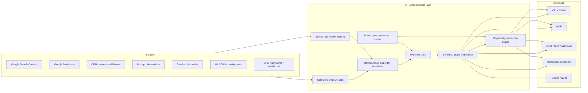

# Data, Integrations, and Architecture

## Architectural goal

Build one evidence layer and expose it through multiple interfaces:



The dashboard must call the same domain services as the CLI and MCP server. Do not reimplement metrics in React components or model prompts.

## Use the existing TrafficClaw foundation

Current reusable areas include:

| Existing area | Reuse |
|---|---|
| `web/src/lib/auth.ts` | Google/GitHub identity and current read-only Google scopes. |
| `web/src/lib/googleApi.ts` | GA4 and GSC request, token, property, report, and data-shaping patterns. |
| `web/src/services/aiChatTools.ts` | Existing analytics, SEO, GitHub, site-audit, funnel, journey, diagnosis, and annotation tools. |
| `web/src/app/api/analytics/**` | GA4 reports, realtime, pages, events, funnels, journeys, retention, goals, and intelligence. |
| `web/src/app/api/seo/**` | Search performance, opportunities, cannibalization, PageSpeed, schema, and page detail. |
| `web/src/app/api/audit/**` | Site auditing and synthesis. |
| `web/src/app/api/alerts`, `cron`, and reporting routes | Scheduled jobs, digests, alerts, exports, and sharing. |
| `plugins/google-analytics` and `plugins/google-search-console` | Packaged connector/command patterns and credential tests. |
| GitHub and site-repo routes | Change context, code search, pull requests, commits, workflow runs, and repository linkage. |

Refactor toward a shared service/library boundary rather than importing Next.js route handlers into a CLI.

## Proposed package layout

This is a target, not an instruction to reorganize the repository immediately:

```text
packages/
  evidence-schema/       # versioned TypeScript types + JSON Schema
  core/                  # metrics, joins, provenance, opportunity rules
  connectors-google/     # GA4, GSC, PSI, CrUX
  connectors-logs/       # Cloudflare, Nginx, Apache, generic JSON
  connectors-site/       # crawler, HTML, schema, robots, Lighthouse
  connectors-changes/    # GitHub, CMS, deploy webhooks
  agent-registry/        # bot purposes, identities, verification sources
  cli/                   # aitraffic executable
  mcp/                   # resources and tools over core
  sdk/                   # REST client and types

web/                     # TrafficClaw hosted UI and API
admin/                   # jobs, secrets, tenant operations
```

If a monorepo refactor would slow initial validation, begin with `web/src/services/aitraffic/` and extract packages after the data contracts stabilize.

## Evidence envelope

Every source record should use a common envelope:

```json
{
  "evidence_id": "ev_01J...",
  "workspace_id": "ws_123",
  "site_id": "site_123",
  "evidence_class": "observed",
  "evidence_type": "ga4.session.aggregate",
  "source": {
    "connector": "google-analytics-data-api",
    "account_ref": "acct_hash",
    "property_ref": "properties/123456",
    "source_record_ref": null,
    "method": "runReport",
    "capability_version": "2026-07-29"
  },
  "scope": {
    "url": "https://example.com/pricing",
    "canonical_url": "https://example.com/pricing",
    "entity_ids": ["entity_product_123"],
    "query": null,
    "prompt_id": null
  },
  "time": {
    "observed_at": "2026-07-29T00:00:00Z",
    "period_start": "2026-07-28T00:00:00Z",
    "period_end": "2026-07-29T00:00:00Z",
    "ingested_at": "2026-07-29T08:00:00Z",
    "freshness": "final"
  },
  "dimensions": {
    "channel_group": "AI Assistant",
    "source": "chatgpt.com",
    "medium": "ai-assistant",
    "country": "IND",
    "device": "desktop"
  },
  "metrics": {
    "sessions": 12,
    "key_events": 2,
    "revenue": 149
  },
  "quality": {
    "confidence": 1,
    "verification": "platform_api",
    "sample_size": 12,
    "limitations": [
      "Only referrals retained by the browser and analytics configuration are observed."
    ]
  },
  "raw_artifact_ref": "blob://...",
  "schema_version": "1.0.0"
}
```

### Evidence classes

| Class | Definition | Examples |
|---|---|---|
| `observed` | Direct first-party or authoritative platform observation | Log request, GSC row, GA4 aggregate, conversion, deployed HTML |
| `sampled` | Observation produced by a declared sampling procedure | Prompt answer, consumer search screenshot, repeated citation run |
| `inferred` | Computed interpretation with traceable inputs | Opportunity, anomaly, likely intent mismatch, source gap |
| `action` | Proposed, approved, executed, or rolled-back change | Issue, pull request, CMS draft, robots change, deploy |
| `unknown` | Explicitly unavailable relationship | Unobservable dark-AI influence, unproven citation-to-sale path |

Never convert `unknown` to zero. Missing, unavailable, below threshold, and observed zero are different states.

## Core entities

### Workspace and sources

- workspace;
- site/domain;
- user/team/role;
- connector/account/property;
- source capability;
- sync job, cursor, quota, and error;
- retention and consent policy.

### Web and search

- URL and canonical URL;
- page/template/directory;
- query and query cluster;
- sitemap;
- crawl/fetch/render observation;
- index/search appearance observation;
- schema node and entity;
- internal/external link.

### AI and agent

- agent/operator;
- claimed user agent;
- behavior class: search, agent, training, transact, SEO, other;
- verification source and level;
- prompt/panel/run;
- model/surface/locale/account context;
- answer, mention, recommendation, citation;
- tool/API/transaction call.

### Analytics and business

- session/referral aggregate;
- event/key event;
- lead/account/opportunity;
- transaction/subscription/revenue/refund;
- attribution/association rule.

### Change and evaluation

- hypothesis;
- action/change;
- code/CMS/deploy reference;
- treatment/control page set;
- deterministic verification;
- performance evaluation;
- confounder/annotation.

## Joins and identity resolution

### URL resolution

Store all of:

- observed URL;
- normalized URL;
- redirect destination;
- declared canonical;
- selected/observed platform canonical where available;
- domain/property ownership.

Do not destructively collapse records onto a canonical because query parameters, redirects, and alternate pages can matter to diagnostics.

### Entity resolution

Use deterministic identifiers before embeddings:

- domain and verified ownership;
- canonical URL;
- Schema.org `@id`;
- GTIN/MPN/SKU;
- organization registration or recognized identifiers;
- Google property/site IDs;
- CRM/payment IDs;
- Git repository and path.

Use aliases and fuzzy matching only with stored confidence and review.

### Time alignment

GSC uses Pacific-time date semantics for its API. GA4 property timezone can differ. Logs are usually UTC. Prompt observations have precise timestamps. Normalize to UTC but retain source timezone and reporting date.

Joins should state their grain:

- page/day;
- query/page/day;
- source/landing-page/day;
- prompt/run;
- agent/path/request;
- change/page/time window.

Avoid joining individual GSC queries to individual GA4 sessions; the source data does not provide that identity.

## Connectors

## Google Search Console

Support:

- site discovery;
- Search Analytics query with dimensions, filters, search types, and paging;
- sitemap list/submit with explicit write scope;
- URL Inspection for selected high-value URLs;
- current UI/export ingestion for generative-AI reports where available;
- quota and incomplete/fresh-data metadata.

Important documented constraints:

- Search Analytics `rowLimit` is at most 25,000 per response.
- Google documents a maximum of 50,000 rows per day per search type for the export pattern.
- Results do not guarantee every row; low-volume data may be omitted or protected.
- The currently documented API search types are web, image, video, news, Discover, and Google News; capability-detect separate generative reporting.

Store the request body and response metadata so users can reproduce an aggregate.

## Google Analytics 4

Support:

- account/property discovery;
- core, realtime, funnel, batch, and metadata reports as justified;
- native AI Assistant channel/medium;
- landing page, source/medium, campaign, key event, transaction, and revenue;
- configured custom dimensions/metrics;
- quota tokens and sampling/thresholding metadata where applicable.

Google’s Data API quota model charges tokens based on request complexity. Standard properties currently have 200,000 Core tokens per property per day, with hourly and per-project/property limits. Cache reusable reports, coalesce jobs, use incremental syncs, and expose quota health.

Keep source fields:

```text
sessionDefaultChannelGroup
sessionSource
sessionMedium
sessionCampaignName
pageReferrer where available and appropriate
landingPagePlusQueryString
```

Do not overwrite Google’s native classification with a custom regex. Add a normalized layer beside it.

## CDN, server, and middleware

Initial:

- Cloudflare;
- generic JSON/NDJSON;
- Nginx combined/custom logs;
- Apache common/combined;
- Next.js/Node middleware;
- Python ASGI/WSGI middleware.

Later:

- Fastly, Akamai, AWS CloudFront/WAF/ALB, Vercel, Netlify, Fly, and other high-demand sources.

Minimum request fields:

- timestamp;
- request method, scheme, host, path, query policy;
- response status and bytes;
- user agent;
- source IP or privacy-preserving verification material;
- referrer;
- cache/CDN/bot metadata;
- request ID;
- latency;
- verified identity/signature metadata where available.

Privacy defaults:

- hash or discard raw IP after verification/geolocation according to policy;
- redact known sensitive query parameters and paths;
- configurable allowlist/denylist;
- short raw-log retention with longer aggregates;
- do not store request bodies by default.

## Prompt and search observations

Collectors need adapters because the observation method changes quality:

| Method | Strength | Limitation |
|---|---|---|
| Official API | Reproducible and structured | May differ from consumer product and omit citations/personalization. |
| Controlled browser | Closer to consumer surface | Operationally expensive; UI, account, geo, and policy change. |
| User-provided export | High trust for that observation | Manual and sparse. |
| Search result provider | Scalable for supported surfaces | Third-party methodology and terms must be assessed. |
| Unofficial scraping | Sometimes broad | Fragile, legal/ToS, accuracy, and account-risk concerns. |

Record the method. Never mix them in a score without disclosure.

Prompt cost controls:

- per-panel and workspace budgets;
- scheduled cadence by prompt value;
- repeats only where variance matters;
- caching only when the experiment permits;
- failure and retry caps;
- BYOK option;
- maximum-answer storage and copyright-aware retention.

## Site crawler and auditors

The crawler should emit facts, not final verdicts:

- request/response;
- redirect;
- raw and rendered DOM;
- extracted metadata/headings/links;
- robots/canonical/hreflang;
- structured data;
- media;
- content fingerprint;
- performance/a11y audit references.

Rules and AI then produce inferences with citations to those facts.

Use:

- HTTP fetch for broad coverage;
- browser rendering only when necessary or sampled;
- per-host rate limits and robots policy;
- crawl-budget controls;
- URL traps and content deduplication;
- user-configurable authentication for owned staging sites.

## Change sources

Ingest:

- Git commit, pull request, author, file, deploy, and release;
- CMS revision and publication;
- sitemap/robots/schema/title/content diff;
- product feed update;
- campaign/PR/product launch annotation;
- known algorithm/documentation updates as external context.

A model can explain a correlation only after the evidence engine identifies a temporal and scoped overlap.

## Business sources

Start with generic contracts:

```text
lead_created
lead_qualified
opportunity_created
revenue_recognized
subscription_started
subscription_cancelled
refund
```

Adapters can cover HubSpot, Salesforce, Stripe, Dodo Payments, ecommerce platforms, and warehouses later. Preserve the customer’s own definitions and do not silently equate a GA4 key event with revenue.

## CLI design

### Principles

- non-interactive flags for agents and CI;
- interactive setup for humans;
- stable JSON on stdout, progress/errors on stderr;
- exit codes and machine-readable error types;
- explicit workspace/site context;
- `--dry-run` for write actions;
- confirmation or policy token for destructive actions;
- local-first config with no secrets committed to Git;
- output schema version.

### Example

```bash
aitraffic opportunities \
  --site example.com \
  --since 28d \
  --goal qualified_leads \
  --evidence observed,sampled \
  --format json
```

```json
{
  "schema_version": "1.0.0",
  "site": "example.com",
  "generated_at": "2026-07-29T10:00:00Z",
  "opportunities": [
    {
      "id": "opp_123",
      "type": "ai_referral_conversion_gap",
      "page": "https://example.com/pricing",
      "priority": 0.83,
      "evidence_ids": ["ev_a", "ev_b"],
      "confidence": 0.74,
      "unknowns": ["Unreferred AI influence is not observable."],
      "next_action": {
        "type": "create_experiment",
        "write_permission_required": false
      }
    }
  ]
}
```

## MCP design

Expose mostly read-only resources and narrowly scoped tools.

### Resources

- workspace/site summary;
- evidence schema;
- source capability and health;
- saved report;
- raw observation metadata;
- experiment/change record.

### Read tools

- `list_sites`;
- `get_source_health`;
- `query_search_performance`;
- `query_ai_referrals`;
- `query_agent_requests`;
- `query_prompt_observations`;
- `get_opportunities`;
- `explain_change`;
- `get_experiment_status`.

### Write tools

- `create_annotation`;
- `create_issue`;
- `create_experiment`;
- `request_sync`;
- `prepare_change`.

Keep `publish_change`, `change_robots`, `submit_sitemap`, or `merge_pull_request` out of the default server. If added, require separate authorization, confirmation, and audit.

Security requirements:

- OAuth/resource authorization appropriate to remote MCP;
- tenant isolation on every request;
- no credentials in tool results;
- tool input limits;
- prompt-injection defenses around fetched content;
- allowlisted destinations for fetchers;
- SSRF protections;
- output redaction;
- rate and budget limits;
- idempotency for writes;
- full audit of tool caller, inputs, source records, and action.

## API and SDK

Version:

- evidence schema independently from endpoint version;
- deprecations with a migration window;
- source capability registry because upstream APIs change.

Core endpoint families:

```text
/v1/sites
/v1/sources
/v1/evidence
/v1/search
/v1/referrals
/v1/agents
/v1/prompts
/v1/citations
/v1/opportunities
/v1/changes
/v1/experiments
/v1/reports
```

Use cursor pagination and asynchronous jobs for large imports/reports. Every response should include freshness and source limitations.

## Storage

### Local mode

- SQLite for configuration, entities, aggregates, and modest evidence volume;
- filesystem/object paths for raw artifacts;
- optional DuckDB/Parquet for analytical exports.

### Hosted early stage

- PostgreSQL for tenant/config/entities/jobs;
- object storage for raw logs, prompt artifacts, and exports;
- a queue for sync/crawl/prompt jobs;
- aggregated tables or materialized views.

### Scale path

Add ClickHouse, BigQuery, or another columnar store only when event/log volume justifies it. Do not introduce a heavy analytics database before paid usage requires it.

Partition by workspace/site/time, make retention enforceable, and isolate tenant encryption/access.

## Authentication and Google verification

### OAuth modes

1. **Hosted OAuth** — aitraffic.dev owns a verified Google OAuth client and securely stores encrypted refresh tokens.
2. **Local OAuth** — CLI uses a local/browser flow and local credential storage.
3. **BYO OAuth client** — technical users configure their own Google client.
4. **Service account** — useful for organizations that explicitly grant property access.

Use read-only scopes by default:

```text
https://www.googleapis.com/auth/analytics.readonly
https://www.googleapis.com/auth/webmasters.readonly
```

Request write scopes only at the moment a user enables a specific action. Google classifies some scopes as sensitive, so hosted production requires consent-screen configuration, verification, privacy policy, domain ownership, accurate disclosures, and secure token handling.

### Token security

- envelope encryption with rotated keys;
- never log tokens;
- tenant-scoped secret access;
- refresh-token failure and revocation handling;
- audit every use;
- deletion and disconnect;
- incident response and key rotation;
- no token exposure to the model.

The model calls a bounded tool; the server handles the token.

## Source capability registry

Upstream services change quickly. Keep a registry:

```yaml
source: search-console-api
checked_at: 2026-07-29
capabilities:
  search_analytics: true
  url_inspection: true
  sitemaps_read: true
  sitemaps_write: optional_scope
  generative_ai_report: not_documented
limits:
  max_rows_per_response: 25000
  search_analytics_rows_per_day_per_type: 50000
references:
  - https://developers.google.com/webmaster-tools/v1/searchanalytics/query
```

The UI, CLI, and agents can then explain why a metric is available for one site/source and not another.

## Provenance and metric definitions

Every metric needs:

- human name;
- machine name;
- definition;
- numerator/denominator;
- dimensions/grain;
- source;
- freshness;
- known thresholds/omissions;
- evidence class;
- version;
- examples and non-examples.

Example:

```yaml
name: sampled_owned_citation_rate
definition: Valid runs in the selected panel that cited a normalized owned URL.
numerator: valid runs with >=1 owned citation
denominator: valid prompt runs
does_not_mean:
  - global AI market share
  - click-through rate
  - a stable rank
  - causal revenue
```

## Opportunity engine

Start with deterministic rules over normalized data:

- relevant agent blocked;
- crawler errors on money pages;
- GenAI/search visibility but no suitable landing page;
- AI referrals with weak conversion;
- citation gap against repeated competitor sources;
- high GSC impression and low CTR;
- decay;
- cannibalization candidate;
- schema/feed/page conflict;
- deploy-correlated technical regression.

Use models to summarize evidence, generate hypotheses, or draft actions—not to invent input metrics.

An opportunity should reference immutable evidence IDs and a versioned rule/model:

```text
rule: ai_referral_conversion_gap@1.2.0
inputs: ev_123, ev_456
generated: 2026-07-29
expires/rechecks: 2026-08-05
```

## Open-source boundary

Recommended Apache-2.0 or MIT components:

- CLI;
- evidence schema and JSON Schema;
- bot/agent identity registry;
- collectors and middleware;
- local store;
- import/export;
- MCP server;
- deterministic audit rules;
- connector SDK;
- example dashboards and fixtures.

Paid hosted services:

- managed OAuth and secrets;
- scheduled collection;
- consumer-browser prompt observation;
- long retention and large event volume;
- teams/RBAC/SSO/audit logs;
- alerts and delivery;
- agency portal/white label;
- warehouse sync;
- opt-in benchmarks;
- managed enterprise deployment and support.

This line makes the trust claim real while preserving a viable hosted business.

## Reliability requirements

- idempotent ingestion and writes;
- sync cursors and replay;
- upstream quota-aware scheduling;
- raw artifact hashes;
- source and schema versions;
- data-health dashboards;
- connector contract tests;
- redacted fixtures;
- backfills with explicit job identity;
- no silent partial success;
- cost budgets;
- circuit breakers for prompt/browser and crawling jobs;
- backup, restore, export, and deletion tests.

## Architecture decision

The first implementation should remain operationally modest:

1. shared TypeScript evidence types and JSON Schema;
2. SQLite local mode and PostgreSQL hosted mode;
3. existing Google services behind stable core functions;
4. Cloudflare and generic log import;
5. a small crawler and prompt-run adapter layer;
6. CLI and MCP using the same functions;
7. TrafficClaw UI on the same API;
8. queue/scheduler and object storage only where jobs require them.

Validate paid use before adding web-scale crawling, backlink indexes, a general product-analytics replacement, or a warehouse-heavy architecture.
